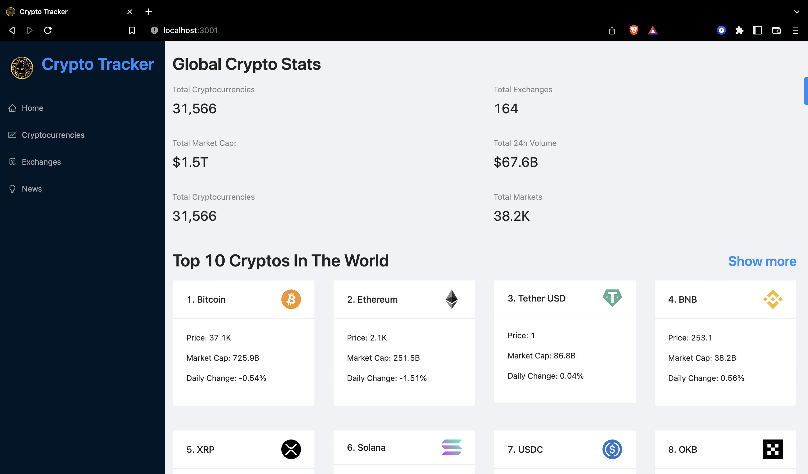
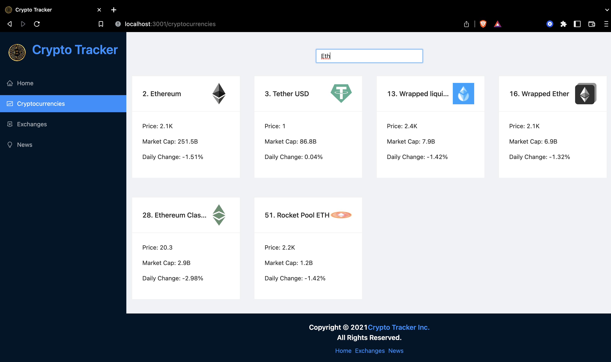
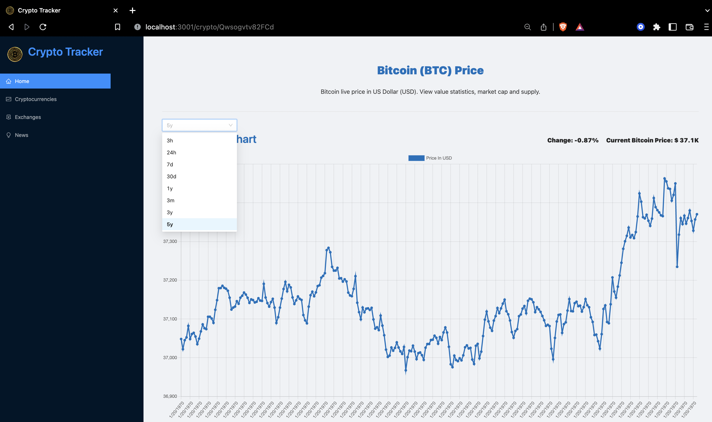
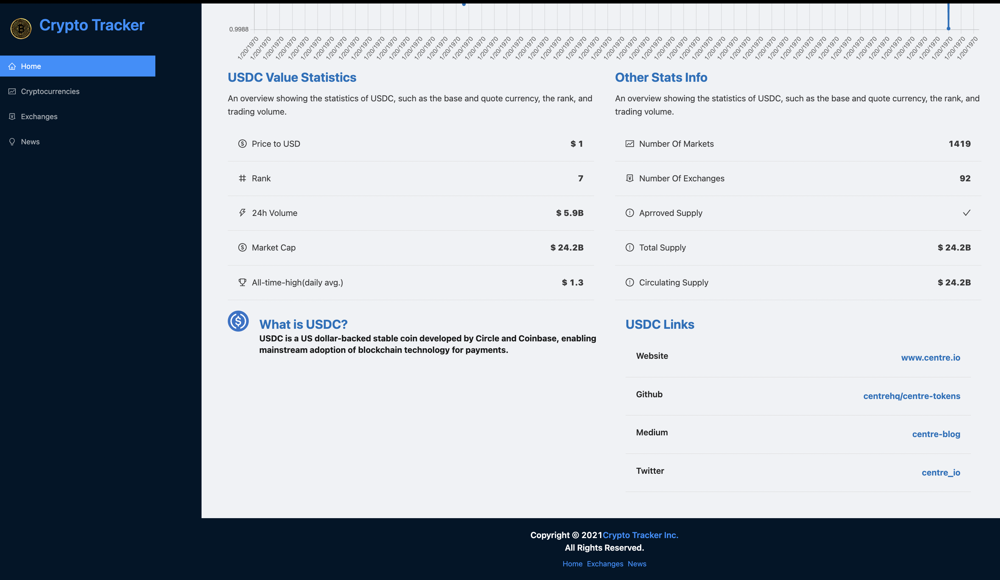

# Crypto Tracker


[View the Crypto Tracker App](https://crypto-tracker-by-remston.netlify.app)


Crypto Tracker is a web application that provides information about cryptocurrencies, exchanges, and related news. This project is developed by Remston Dsa.

## Project Structure
```
    .
    ├── components
    │ ├── Cryptocurrencies.jsx
    │ ├── CryptoDetails.jsx
    │ ├── Exchanges.jsx
    │ ├── Homepage.jsx
    │ ├── index.js
    │ ├── LineChart.jsx
    │ ├── Loader.jsx
    │ └── Navbar.jsx
    │ └── News.jsx
    ├── images
    │ ├── cryptocharts.png
    │ ├── cryptocurrencies.png
    │ ├── cryptocurrency.png
    │ ├── cryptostats.png
    │ ├── home.png
    │ └── news.png
    ├── app
    │ └── store.js
    └── services
    ├── cryptoApi.js
    └── cryptoNewsApi.js


```

### Components

- **Cryptocurrencies.jsx:** Component for displaying a list of cryptocurrencies.
- **CryptoDetails.jsx:** Component for detailed information about a specific cryptocurrency.
- **Exchanges.jsx:** Component for displaying information about cryptocurrency exchanges.
- **Homepage.jsx:** Component representing the main homepage of the application.
- **LineChart.jsx:** Component for rendering line charts, possibly for price trends.
- **Loader.jsx:** Component for displaying a loading indicator.
- **Navbar.jsx:** Component representing the navigation bar.
- **News.jsx:** Component for displaying cryptocurrency-related news.

### Images

- **cryptocurrency.png:** Image resource for the project.

### App

- **store.js:** Configuration for the application's state management, possibly using a state management library like Redux.

### Services

- **cryptoApi.js:** Service for fetching data related to cryptocurrencies.
- **cryptoNewsApi.js:** Service for fetching cryptocurrency news.

## Application Preview

### Home Page


### Cryptocurrencies Section


### Crypto Charts


### Crypto Stats


### News Section


## Usage

1. Clone the repository.
2. Install dependencies using `npm install`.
3. Start the application with `npm start`.

## Credits

- Modified by Remston Dsa Nov 11, 2023. Referred to https://github.com/adrianhajdin/threads

## License

This project is licensed under the [MIT License](LICENSE).
